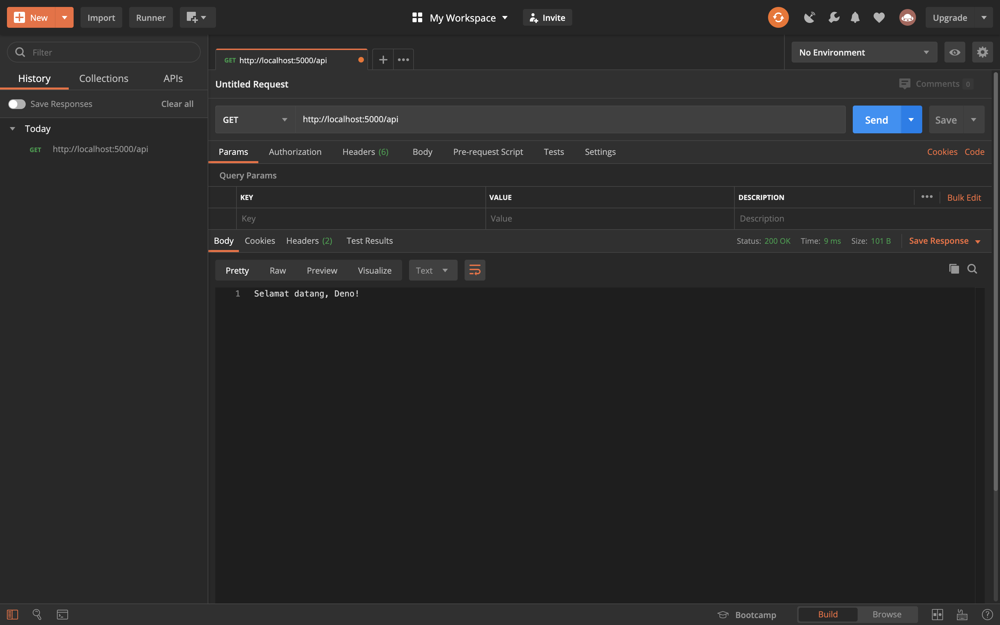
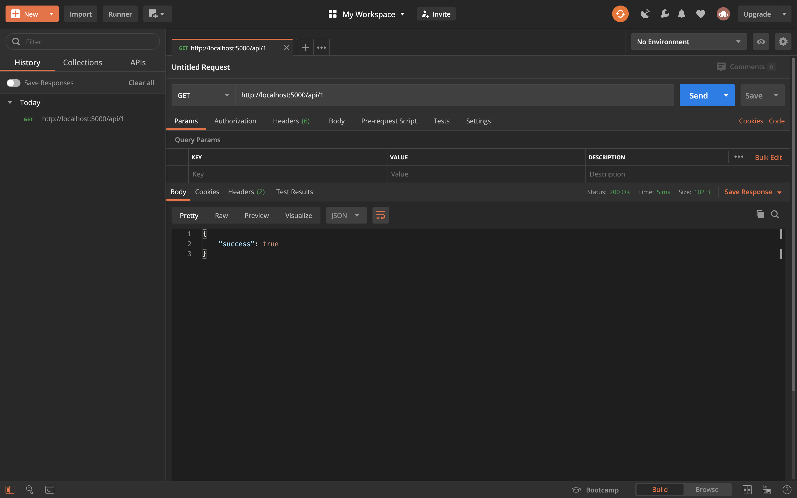
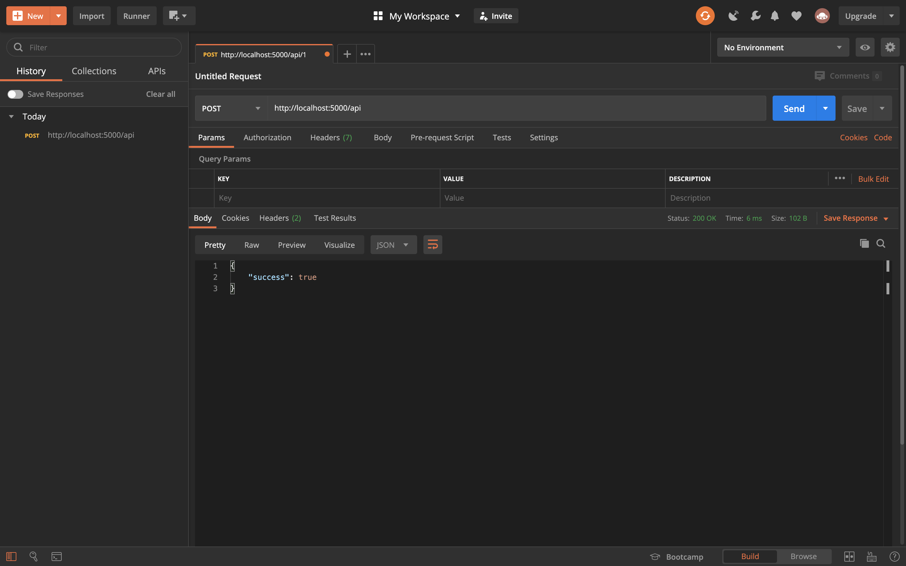
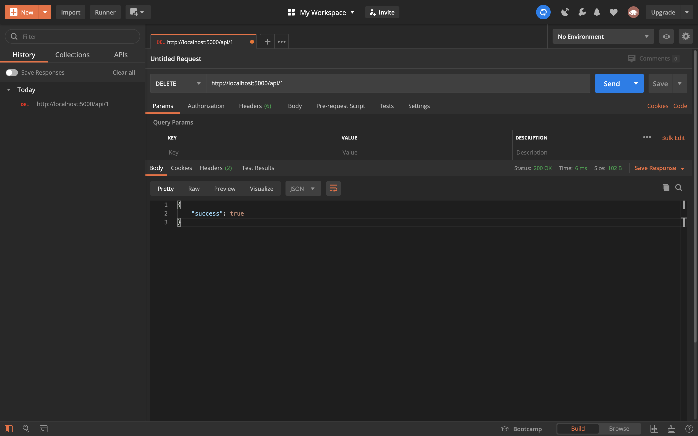

# HOW TO MAKE SIMPLE DENO API

---

1. make `server.ts` in your folder.
2. inside of it we import Application and Router like this:

```ts
import { Application, Router } from "https://deno.land/x/oak/mod.ts";
```

FYI for Deno, they are not using any `package.json` or `node_modules`. they are now entirely online. so, you will import them from [deno.land](https://deno.land) in standard library or [std](https://deno.land/std).

3. after that, we going to initialize app and port, under `import`.

```ts
const port = 5000;
const app = new Application();

console.log(`server running on port ${port}`);

await app.listen({ port });
```

and now to execute it. we need to use our terminal and call:

```bash
deno run --allow-net server.ts
```

remember we want to use `--allow-net` or the flag. and there's many more of the flag like `--allow-read` or `--allow-write` and so on.

and now when we execute it. it will say that we don't have middleware to process requests, because we didn't initialize Router. now we going to make Router:

```ts
import { Application, Router } from "https://deno.land/x/oak/mod.ts";

const port = 5000;
const app = new Application();
const router = new Router();

app.use(router.routes());
app.use(router.allowedMethods());

console.log(`server running on port ${port}`);

await app.listen({ port });
```

now we going to make GET API with the router:

```ts
import { Application, Router } from "https://deno.land/x/oak/mod.ts";

const port = 5000;
const app = new Application();
const router = new Router();

app.use(router.routes());
app.use(router.allowedMethods());

router.get("/api", ({ response }: { response: any }) => {
  response.body = "Selamat datang, Deno!";
});

console.log(`server running on port ${port}`);

await app.listen({ port });
```

and now we can execute it.

```bash
deno run --allow-net server.ts
```

right now we just use `response` not `useContext` because, again. we just need a response right now. and we use `{ response: any }` since right now we using typescript.

and now we use postman to see if the response is okay to the postman.

now we just type "http://localhost:5000/api".



now since this, all functions are in one place. Let's move the router to a separate file, so we can have a clean code.

now in `server.ts` cut some the line using `ctrl + x`. and it should be like this:

```ts
import { Application } from "https://deno.land/x/oak/mod.ts";

const port = 5000;
const app = new Application();

app.use(router.routes());
app.use(router.allowedMethods());

console.log(`server running on port ${port}`);

await app.listen({ port });
```

now we going `ctrl + v` the line that has just been cut, and also make a file name `routes.ts` and put in there:

```ts
import { Router } from "https://deno.land/x/oak/mod.ts";

const router = new Router();

router.get("/api", ({ response }: { response: any }) => {
  response.body = "Selamat datang, Deno!";
});

export default router;
```

now we already export the router, now we going to import the router into `server.ts` and it should be like this:

```ts
import { Application } from "https://deno.land/x/oak/mod.ts";
import router from "./router.ts";

const port = 5000;
const app = new Application();

app.use(router.routes());
app.use(router.allowedMethods());

console.log(`server running on port ${port}`);

await app.listen({ port });
```

now we have clean code and its already a response in postman. what's next 🤷 ?
we going to add products so we can have a functional REST API

we going to make `folder` any name you want but I want to name it `controllers`. inside of it we make a file name `products.ts` and we going to add our products, here's my example for it

```ts
interface Product {
  id: number;
  name: string;
  desc: string;
  price: number;
  condition: string;
}

let products: Product[] = [
  {
    id: 1,
    name: "Macbook Pro 2018",
    desc: "13 inch, 8 GB RAM",
    price: 20000000,
    condition: "new",
  },
  {
    id: 2,
    name: "Motorola G5S Plus",
    desc: "5.5 inch, 4 GB RAM",
    price: 3000000,
    condition: "new",
  },
  {
    id: 3,
    name: "Acer E5 475G",
    desc: "14 inch, 12 GB RAM (upgraded)",
    price: 7000000,
    condition: "used",
  },
  {
    id: 4,
    name: "iPad 2",
    desc: "10 inch, 2 GB RAM",
    price: 5000000,
    condition: "new",
  },
];
```

and again since we want clean code, we going to move the interface and export it. now we going to make another file in the base folder and create `types.ts` and cut the interface and it should be like this:

`product.ts`:

```ts
import { Product } from "../types.ts";

let products: Product[] = [
  {
    id: 1,
    name: "Macbook Pro 2018",
    desc: "13 inch, 8 GB RAM",
    price: 20000000,
    condition: "new",
  },
  {
    id: 2,
    name: "Motorola G5S Plus",
    desc: "5.5 inch, 4 GB RAM",
    price: 3000000,
    condition: "new",
  },
  {
    id: 3,
    name: "Acer E5 475G",
    desc: "14 inch, 12 GB RAM (upgraded)",
    price: 7000000,
    condition: "used",
  },
  {
    id: 4,
    name: "iPad 2",
    desc: "10 inch, 2 GB RAM",
    price: 5000000,
    condition: "new",
  },
];
```

`types.ts`:

```ts
export interface Product {
  id: number;
  name: string;
  desc: string;
  price: number;
  condition: string;
}
```

now we going to make function to get all products and route to GET API. first we going to make `getProducts` function under `products.ts`:

```ts
const getProducts = ({ response }: { response: any }) => {
  response.body = {
    success: true,
    data: products,
  };
};

export { getProducts };
```

and now in the `routes.ts`, we going to import `getProducts` function and call it.

```ts
import { Router } from "https://deno.land/x/oak/mod.ts";
import { getProducts } from "./controllers/products.ts";

const router = new Router();

router.get("/api", getProducts);

export default router;
```

now this is calling all product. how 'bout we call single one of them and the rest of the CRUD? brace yourself bois. (this all are under the `products`)
`product.ts`:

```ts
// desc: get all product ↓
// routes: GET /api ↓
const getProducts = ({ response }: { response: any }) => {
  response.body = {
    success: true,
    data: products,
  };
};

// desc: get single product ↓
// routes: GET /api/:id ↓
const getProduct = ({ response }: { response: any }) => {
  response.body = {
    success: true,
  };
};

// desc: add product ↓
// routes: POST /api ↓
const addProduct = ({ response }: { response: any }) => {
  response.body = {
    success: true,
  };
};

// desc: update product ↓
// routes: PUT /api/:id ↓
const updateProduct = ({ response }: { response: any }) => {
  response.body = {
    success: true,
  };
};

// desc: delete product ↓
// routes: DELETE /api/:id ↓
const deleteProduct = ({ response }: { response: any }) => {
  response.body = {
    success: true,
  };
};
export { getProducts, getProduct, addProduct, updateProduct, deleteProduct };
```

now we going to import the rest of the CRUD.
`routes.ts`:

```ts
import { Router } from "https://deno.land/x/oak/mod.ts";
import {
  getProducts,
  getProduct,
  addProduct,
  updateProduct,
  deleteProduct,
} from "./controllers/products.ts";

const router = new Router();

router
  .get("/api", getProducts)
  .get("/api/:id", getProduct)
  .post("/api", addProduct)
  .put("/api/:id", updateProduct)
  .delete("/api/:id", deleteProduct);

export default router;
```

now to make sure that the CRUD is on. we'll just call each one of them in postman






# right now I'm going to study 🇯🇵 language. and I'll update it as soon as I can 😉.
